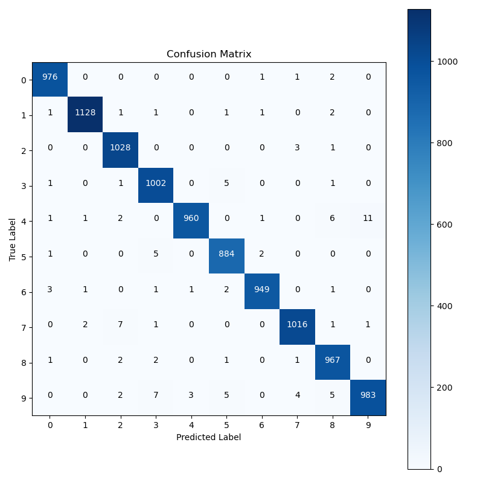

# MNIST CNN Classifier

A PyTorch-based Convolutional Neural Network (CNN) designed to classify handwritten digits from the MNIST dataset. This project includes data exploration, model development, training, evaluation, and visualization of results. The repository is organized to facilitate easy understanding, modular development, and thorough analysis.

## Table of Contents

- [Project Overview](#project-overview)
- [Directory Structure](#directory-structure)
- [Installation](#installation)
- [Usage](#usage)
  - [Training](#training)
  - [Evaluation](#evaluation)
  - [Visualization](#visualization)
- [Results](#results)
- [License](#license)
- [Acknowledgments](#acknowledgments)

## Project Overview

This project focuses on building a CNN model to classify digits from the MNIST dataset. The project is divided into several stages: exploratory data analysis, model prototyping, training, evaluation, and visualization of results. The model achieves high accuracy and includes detailed performance metrics, such as confusion matrix, precision, recall, and F1-score for each class.

## Directory Structure

The repository is organized as follows:

```plaintext
MNIST_CNN_Project/
├── data/                              
├── saved_models/                      
│   └── mnist_cnn_final.pth                         
├── src/                               
│   ├── data_loader.py                 
│   ├── cnn_model.py                   
│   ├── train.py                       
│   ├── evaluate.py                    
│   ├── metrics.py                     
│   └── main.py                        
├── notebooks/                         
│   ├── EDA_MNIST.ipynb                
│   ├── Model_Prototyping.ipynb        
│   ├── Model_Results_and_Visualizations.ipynb  
│   └── Project_Walkthrough.ipynb   
├── images/                            
│   ├── loss_vs_epoch.png              
│   ├── confusion_matrix.png           
│   └── ...                            
├── README.md                          
├── requirements.txt                   
├── .gitignore                         
└── LICENSE                            
```

## Installation

### Prerequisites

- Python 3.7 or higher
- Pip (Python package installer)
- Virtual environment (optional but recommended)

### Setup

1. **Clone the repository**:

   ```bash
   git clone https://github.com/your-username/MNIST_CNN_Project.git
   cd MNIST_CNN_Project
   ```

2. **Create a virtual environment (optional)**:

   ```bash
   python -m venv venv
   source venv/bin/activate  # On Windows use `venv\Scripts\activate`
   ```

3. **Install the required dependencies**:

   ```bash
   pip install -r requirements.txt
   ```

## Usage

### Training

To train the CNN model on the MNIST dataset:

```bash
python src/main.py
```

This will train the model for 10 epochs and save the final model as `mnist_cnn_final.pth` in the `saved_models/` directory. A checkpoint will also be saved after 10 epochs.

### Evaluation

To evaluate the trained model and generate a confusion matrix:

```bash
python src/evaluate.py
```

This script will output the confusion matrix and calculate precision, recall, and F1-score for each class.

### Visualization

To visualize training loss, confusion matrix, and other metrics, refer to the Jupyter notebooks in the `notebooks/` directory:

- `Model_Results_and_Visualizations.ipynb`: Contains code to visualize the results of the trained model.

## Results

The final model achieves high accuracy on the MNIST test dataset. Below are some key visualizations:

### Training Loss vs Epoch


### Confusion Matrix



### Precision, Recall, and F1-Score

| Class | Precision | Recall | F1-Score |
|-------|-----------|--------|----------|
| 0     | 0.98      | 0.97   | 0.97     |
| 1     | 0.99      | 0.98   | 0.98     |
| ...   | ...       | ...    | ...      |

## License

This project is licensed under the MIT License - see the [LICENSE](LICENSE) file for details.

## Acknowledgments

- The PyTorch community for extensive documentation and tutorials.
- The creators of the MNIST dataset.
- [tqdm](https://github.com/tqdm/tqdm) for the progress bars.
